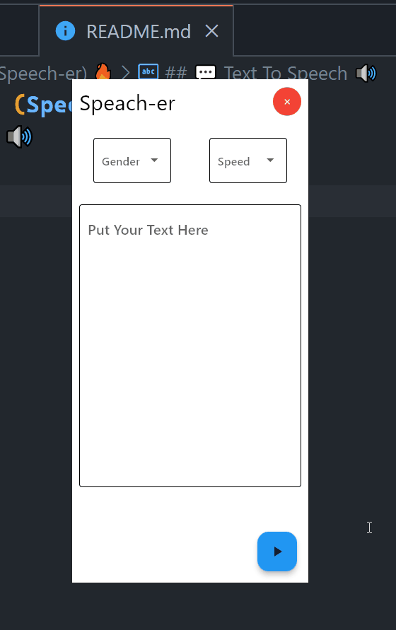

# Flet Python Project (Speech-er) 🔥
## 💬 Text To Speech 🔊

## 🛠 Skills
Python, Flutter, Flet...


## Documentation

[Flet Documentation🔥]([https://linktodocumentation](https://flet.dev/docs/))


## Demo



## Run Locally

Go to the project directory

```bash
  cd speecher-folder
```

Install dependencies

```bash
  pip install flet
```

Start the server

```bash
  flet run main.py -d
```


